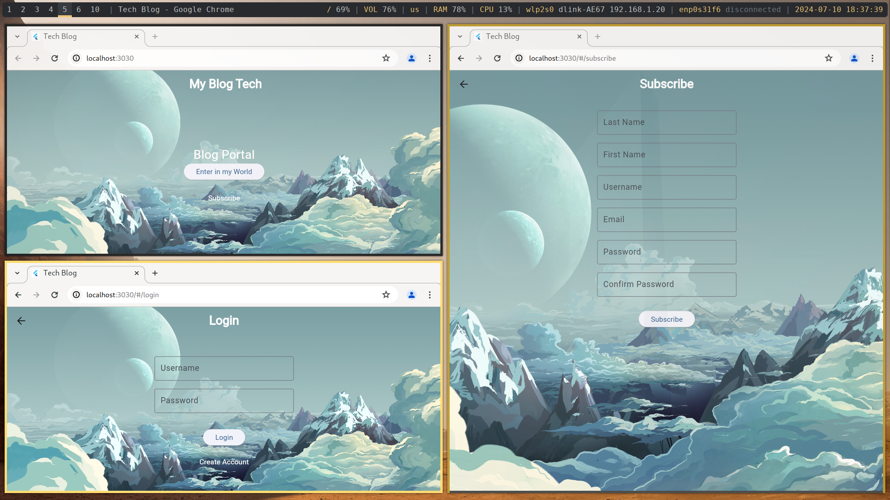

# Flutter Blog Client

This Flutter application serves as a client for interacting with a Django API for a blog, focusing on CRUD operations and JWT authentication. The application utilizes `Provider` for state management and `http` package for making requests to the API.

## Overview

The Flutter Blog Client is designed to provide a user-friendly interface for accessing and managing blog content hosted on a Django backend. It ensures secure authentication using JWT tokens and supports essential CRUD operations (Create, Read, Update, Delete) for blog posts.

## Preview



## Features

- **User Authentication**: Secure login and token-based authentication via JWT.
- **Blog Posts Management**:
  - Create new blog posts.
  - Retrieve a list of blog posts.
  - View detailed information of individual blog posts.
  - Update existing blog posts.
  - Delete unwanted blog posts.
- **State Management**: Utilizes `Provider` for efficient and scalable state management across the application.
- **HTTP Requests**: Communicates with the Django API using the `http` package to perform CRUD operations and manage user sessions.

## Setup

To set up and run the Flutter Blog Client locally, follow these steps:

1. **Clone the Repository**:

   ```bash
   git clone https://github.com/DevprojectEkla/FlutterClient.git
   cd flutter_blog_client
   ```

2. **Install Dependencies**:

   ```bash
   flutter pub get
   ```

3. **Run the Application**:

   ```bash
   flutter run
   ```

4. **Configure API Endpoint**:
   - Open `lib/services/api_service.dart` and set the `baseUrl` variable to point to your Django API endpoint.

## Dependencies

The Flutter Blog Client relies on the following key dependencies:

- **provider**: State management library for Flutter applications.
- **http**: Dart package for making HTTP requests.
- **shared_preferences**: For persisting authentication tokens locally.
- **flutter_secure_storage**: Secure storage for sensitive data on the device.

To install these dependencies, add them to your `pubspec.yaml` file and run `flutter pub get`.

`pubspec.yaml`:

```yaml
dependencies:
flutter:
sdk: flutter
provider: ^5.0.0
http: ^0.13.3
shared_preferences: ^2.0.8
flutter_secure_storage: ^5.2.1
```

## Usage

### Authentication

1. **Login**: Provide username and password to authenticate with the Django API and obtain a JWT token.

2. **Logout**: Clear the JWT token to terminate the session.

### Blog Posts

1. **Retrieve Posts**: Fetch a list of blog posts from the API.

2. **Create Post**: Add a new blog post with relevant details.

3. **Update Post**: Modify the content of an existing blog post.

4. **Delete Post**: Remove a blog post from the database.

## Contributing

Contributions to the Flutter Blog Client are welcome! If you find any issues or have suggestions for improvements, please submit a pull request or open an issue on GitHub.

## License

This project is licensed under the MIT License - see the LICENSE file for details.
